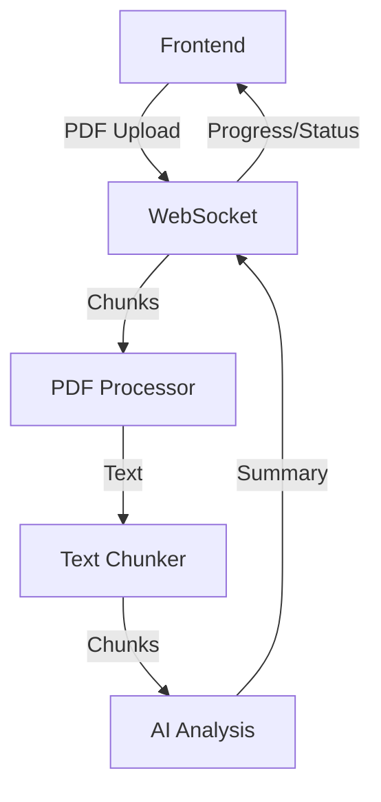

# Architecture Overview

## System Components

### Frontend (SvelteKit)
- PDF Upload/Processing UI
- WebSocket Client with Heartbeat
- Progress Tracking & Status Indicators
- Markdown Renderer
- Error Recovery & Retry Logic

### Backend (FastAPI)
- WebSocket Server
- PDF Processing Pipeline
- OCR Processing (Tesseract)
- Memory Management
- Health Monitoring

## Data Flow

## Processing Pipeline
1. PDF Upload (Chunked Base64)
2. PDF to Image Conversion (Poppler)
3. OCR Text Extraction (Tesseract)
4. Text Chunking & Processing
5. AI Analysis
6. Markdown Generation

## WebSocket Protocol
- Chunked File Upload
- Real-time Progress Updates
- Status Tracking
- Heartbeat Monitoring
- Error Recovery
- Connection Management

## Status Types
- Receiving: File Upload
- Converting: PDF to Images
- Processing: OCR
- Analyzing: AI Processing
- Complete: Done

## Memory Management
- Max Memory: 80% (configurable)
- Garbage Collection
- Failed Chunk Recovery
- Streaming Response
- Resource Cleanup

## Error Handling
- Connection Recovery
- Process Monitoring
- Resource Cleanup
- User Feedback
- Graceful Degradation

## Rate Limiting
- Max File: 100MB
- Chunk Size: 1MB
- Connections: 5/client
- Processing: 2 workers

## Development Setup
- Docker Containers
- Hot Reload
- CORS Configuration
- Environment Variables
- Health Checks