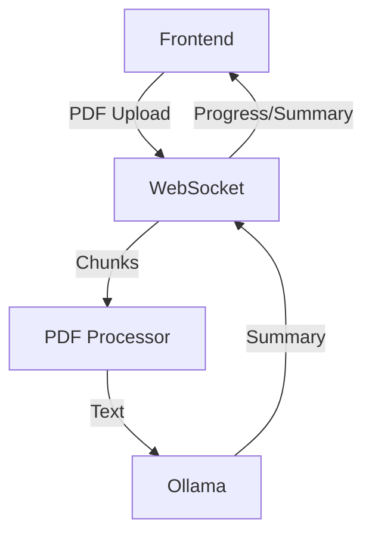

# Architecture Overview

## System Components

### Frontend (SvelteKit)
- PDF Upload/Processing UI
- WebSocket Client
- Markdown Renderer
- Progress Tracking

### Backend (FastAPI)
- WebSocket Server
- PDF Processing
- Ollama Integration
- Memory Management

## Data Flow

## Processing Pipeline
1. PDF Upload
2. Text Extraction (Tesseract)
3. Chunking (2000 tokens)
4. Model Processing
5. Markdown Generation

## Memory Management
- Max Memory: 80%
- Garbage Collection
- Failed Chunk Recovery
- Streaming Response

## Storage
- Temp Storage: Processing
- No Persistence Layer
- Artifact Storage: GitHub

## Rate Limiting
- Max File: 100MB
- Connections: 5/client
- Processing: 2 workers